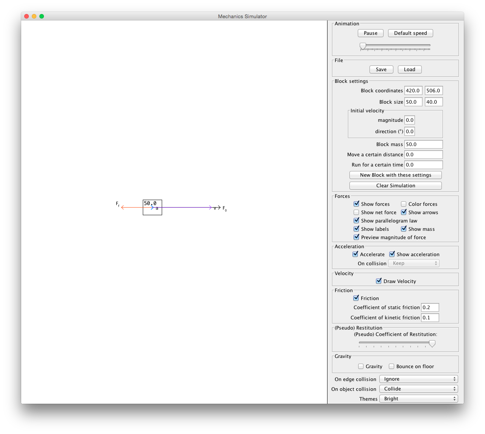

#Mechanics Simulator

(code name: mechanics)

Mechanics Simulator is a Newtonian physics (a.k.a. 'mechanics') simulator, made in Java. It was originally developed for a contest ([제 31회 한국정보올림피아드](https://www.digitalculture.or.kr/sub06/InfoOlympiad.do)). It won a silver medal, and was admitted to yet another science contest/fair, [Intel ISEF](https://student.societyforscience.org/intel-isef). I went to Pittsburgh, PA and had a fun time.

I promised to open source this when I was in Pittsburgh. I try to keep promises.